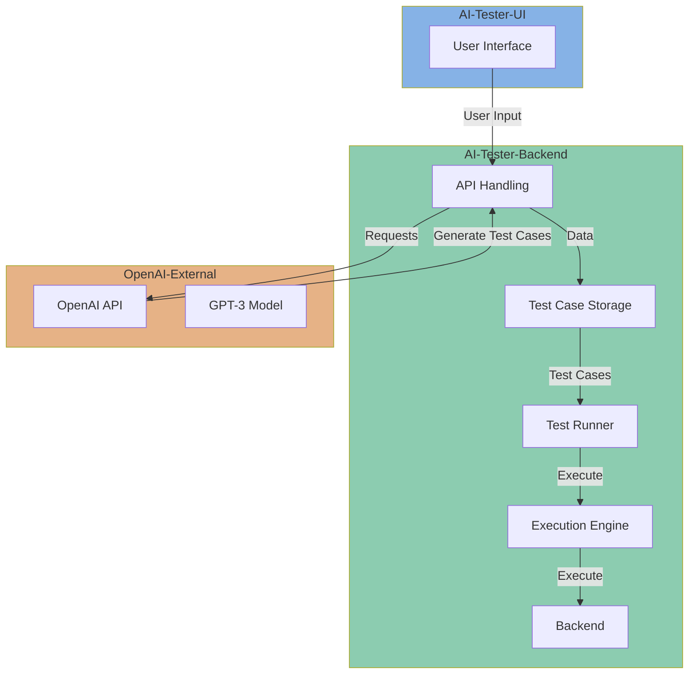

# Index

Introducing our cutting-edge test case generation solution! Harnessing the power of OpenAI's GPT-3, our platform seamlessly combines natural language processing with advanced programming to automate the creation of comprehensive Gherkin-based test cases. Designed with user-friendliness in mind, our web-based interface empowers users to effortlessly specify testing scenarios and parameters. Behind the scenes, a robust backend orchestrates the interaction with the OpenAI API, generating Gherkin scripts that articulate precise testing steps. But we don't stop there – our system goes the extra mile by transforming these generated test cases into executable TypeScript code, ensuring a seamless transition from test design to test automation. This innovative approach not only accelerates the testing process but also enhances collaboration between development and QA teams. Welcome to a new era of efficiency and precision in software testing. Welcome to the future of Test Case Generation.

##  Architecture Design

The architecture for your test case generation solution:

User Interface (UI):

Develop a web-based user interface where users can interact with the system.
Users can input parameters, select test scenarios, and initiate the test case generation process.
Frontend:

Use a frontend framework like React or Angular for building the user interface.
Implement the logic to handle user inputs and make requests to the backend.
Backend:

Create a backend application to handle user requests and orchestrate the test case generation process.
Use a server-side framework like Express (Node.js) or Flask (Python).
OpenAI Integration:

Implement a module to interact with the OpenAI API for test case generation.
Utilize OpenAI GPT-3 to generate Gherkin-based test cases. You'll send prompts to the API and process the responses.
Test Case Storage:

Store generated test cases in a database or a file system for future reference and analysis.
TypeScript Code Generation:

Implement a module to convert Gherkin-based test cases into TypeScript code.
Map Gherkin steps to corresponding TypeScript functions or methods.
Execution Engine:

Develop a component that can execute the generated TypeScript code against the application under test.
This could involve using testing frameworks like Jest or Mocha.
Feedback Mechanism:

Include a feedback loop for users to review and modify generated test cases.
Allow users to provide feedback on the quality and accuracy of the generated tests.
Scalability:

Design the system to be scalable, allowing for parallel processing of test case generation requests.
Logging and Monitoring:

Implement logging and monitoring to track the performance and usage of the system.
Security:

Ensure that the solution adheres to security best practices, especially when handling user inputs and storing generated test cases.
Documentation:

Provide comprehensive documentation for users and developers to understand how to use and extend the system.
By following this architecture, you can create a flexible and scalable solution for generating Gherkin-based test cases using OpenAI and converting them into executable TypeScript code.

## Solution Diagram

