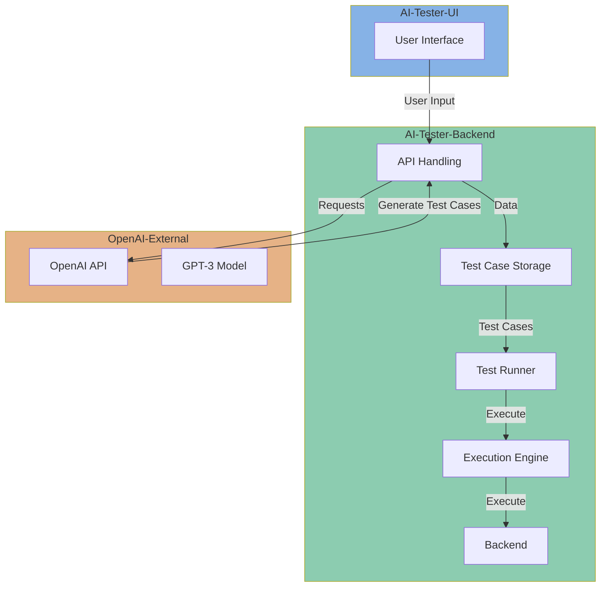
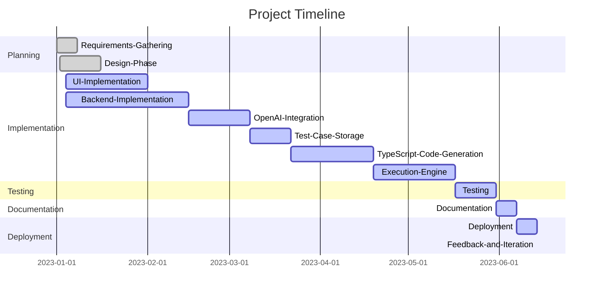

# Index

Introducing our cutting-edge test case generation solution! Harnessing the power of OpenAI's GPT-3, our platform seamlessly combines natural language processing with advanced programming to automate the creation of comprehensive Gherkin-based test cases. Designed with user-friendliness in mind, our web-based interface empowers users to effortlessly specify testing scenarios and parameters. Behind the scenes, a robust backend orchestrates the interaction with the OpenAI API, generating Gherkin scripts that articulate precise testing steps. But we don't stop there – our system goes the extra mile by transforming these generated test cases into executable TypeScript code, ensuring a seamless transition from test design to test automation. This innovative approach not only accelerates the testing process but also enhances collaboration between development and QA teams. Welcome to a new era of efficiency and precision in software testing. Welcome to the future of Test Case Generation.

##  Architecture Design

The architecture for your test case generation solution:

User Interface (UI):

Develop a web-based user interface where users can interact with the system.
Users can input parameters, select test scenarios, and initiate the test case generation process.
Frontend:

Use a frontend framework like React or Angular for building the user interface.
Implement the logic to handle user inputs and make requests to the backend.
Backend:

Create a backend application to handle user requests and orchestrate the test case generation process.
Use a server-side framework like Express (Node.js) or Flask (Python).
OpenAI Integration:

Implement a module to interact with the OpenAI API for test case generation.
Utilize OpenAI GPT-3 to generate Gherkin-based test cases. You'll send prompts to the API and process the responses.
Test Case Storage:

Store generated test cases in a database or a file system for future reference and analysis.
TypeScript Code Generation:

Implement a module to convert Gherkin-based test cases into TypeScript code.
Map Gherkin steps to corresponding TypeScript functions or methods.
Execution Engine:

Develop a component that can execute the generated TypeScript code against the application under test.
This could involve using testing frameworks like Jest or Mocha.
Feedback Mechanism:

Include a feedback loop for users to review and modify generated test cases.
Allow users to provide feedback on the quality and accuracy of the generated tests.
Scalability:

Design the system to be scalable, allowing for parallel processing of test case generation requests.
Logging and Monitoring:

Implement logging and monitoring to track the performance and usage of the system.
Security:

Ensure that the solution adheres to security best practices, especially when handling user inputs and storing generated test cases.
Documentation:

Provide comprehensive documentation for users and developers to understand how to use and extend the system.
By following this architecture, you can create a flexible and scalable solution for generating Gherkin-based test cases using OpenAI and converting them into executable TypeScript code.

## Solution Diagram

Project Planning:

1. Requirements Gathering (1 week): Define and document the specific requirements for the user interface, backend functionality, OpenAI integration, test case storage, TypeScript code generation, and the execution engine.

2. Design Phase (2 weeks): Create detailed design documents for each module. Specify the UI layout, API structure, database schema, and integration points with OpenAI.

3. Implementation (6 weeks): Develop the user interface using React/Angular, set up the backend using Express/Flask, integrate with the OpenAI API, implement the test case storage mechanism, and develop the TypeScript code generation and execution engine.

4. Testing (2 weeks): Conduct thorough testing of each module, including unit testing, integration testing, and end-to-end testing. Gather feedback and make necessary adjustments.

5. Documentation (1 week): Prepare comprehensive documentation for users, developers, and administrators, covering installation, usage, and maintenance.

6. Deployment (1 week): Deploy the solution to a staging environment for final testing and then to a production environment for public use.

7. Feedback and Iteration (Ongoing): Continuously collect user feedback, monitor system performance, and make iterative improvements based on user needs and changing requirements.

## Simple Estimation

1. User Interface (UI): 4 weeks

Frontend development using React/Angular.
1. Backend: 6 weeks

Implement backend logic, API handling, and database connectivity.
1. OpenAI Integration: 3 weeks

Integrate with the OpenAI API for test case generation.
1. Test Case Storage: 2 weeks

Implement storage for generated test cases.
1. TypeScript Code Generation: 4 weeks

Develop logic to convert Gherkin to TypeScript code.
1. Execution Engine: 4 weeks

Create a component to execute TypeScript code against the application.
1. Testing: 2 weeks

Conduct various testing phases, including user testing.
1. Documentation: 1 week

1. Deployment: 1 week

1. Feedback and Iteration: Ongoing

## Gantt

## Feasibility Analysis

### Technical Feasibility

- Technology Analysis: Integrating with OpenAI and developing the logic for test case generation is technically feasible, considering the availability of suitable technologies and resources.

- Technical Competence: Assessing the availability of the required technical skills and expertise to implement the solution, including proficiency in frontend (React/Angular), backend (Node.js/Express or Python/Flask), and OpenAI integration.

### Operational Feasibility

- Resource Availability: Ensure that the necessary hardware, software, and human resources are available to support the project's operational requirements.

- Training Needs: Identify any training needs for team members or end-users to effectively use the test case generation system.

- Economic Feasibility:

- Cost-Benefit Analysis: Conduct a cost-benefit analysis to determine if the benefits gained from the project justify the associated costs, including development, deployment, and maintenance.

- ROI (Return on Investment): Evaluate the potential return on investment, considering both tangible and intangible benefits.

### Schedule Feasibility:

- Project Timeline: Assess the practicality of the proposed timeline for the project, considering the availability of resources and potential dependencies.

- Time-to-Market Impact: Evaluate the impact of the project's time-to-market on its overall success and relevance.

- Legal and Ethical Feasibility:

- Compliance: Ensure that the project complies with legal and ethical standards, especially concerning data privacy and the use of AI technologies.

- Intellectual Property: Address any potential issues related to intellectual property, copyrights, or licensing agreements.

### Cultural Feasibility:

- User Acceptance: Assess the likelihood of user acceptance and adoption, considering the cultural context and user expectations.

- Organizational Fit: Evaluate how well the project aligns with the organization's culture, goals, and strategic objectives.
